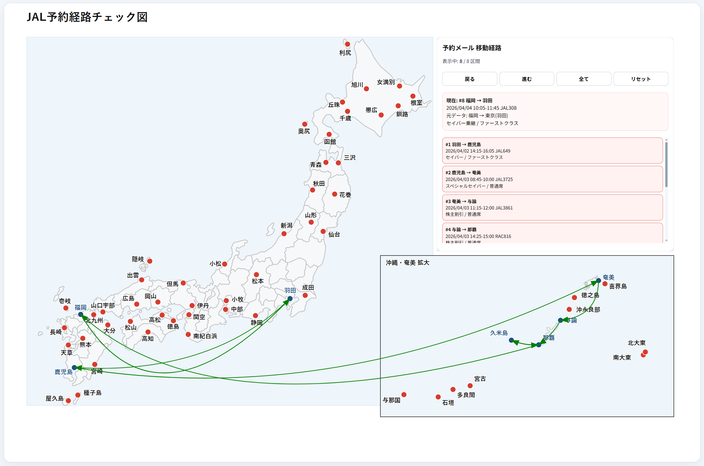
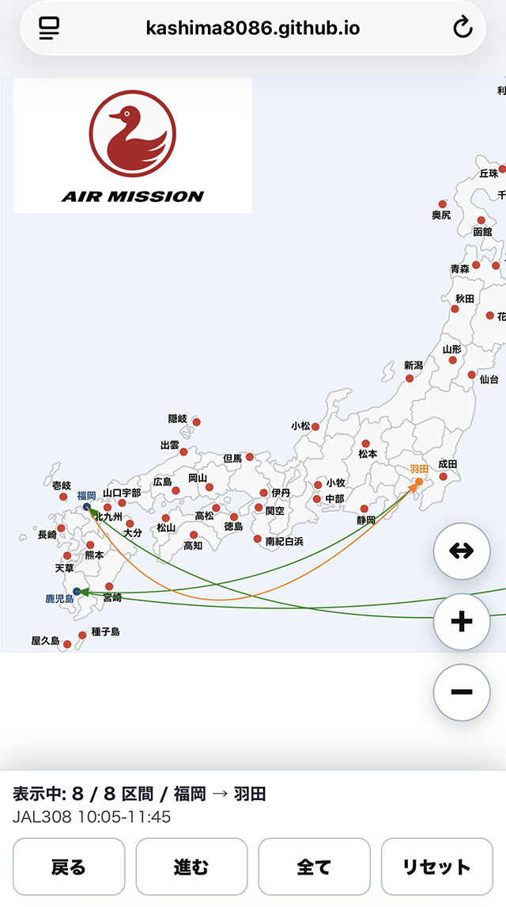

# JAL予約経路チェック図 生成ツール

<br>
<p align="left">
  
</p>

## 概要

JALの予約メールを解析し、日本地図上に移動経路を表示するHTMLを生成するツールです。

- IMAPからメールを直接取得可能
- 保存済みメール本文テキストでもテスト可能
- 時系列UIで移動経路を順番に確認可能

---

## ファイル構成

| ファイル | 説明 |
|---|---|
| `jal_mail_to_route_map.py` | メインプログラム |
| `JALMailEngine.py` | メール解析エンジン |
| `jal_route_map.tmpl` | SVG地図テンプレート |

---

## 基本実行（IMAP）

```bash
python jal_mail_to_route_map.py
```

---

## 保存済みメールでテスト

```bash
python jal_mail_to_route_map.py --text mail1.txt mail2.txt
```

> ⚠ 保存するメール本文テキストの文字コードは UTF-8 にしてください。  
> Shift_JIS など他の文字コードの場合、正しく解析できません。

---

## ロゴ画像表示機能

`--logo` オプションを指定すると、地図左上へ指定したロゴ画像を表示できます。

```bash
python jal_mail_to_route_map.py --logo mylogo.jpg
```

- JPG画像を使用してください
- ロゴ画像は生成されるHTMLと同じディレクトリに配置してください
- スマートフォン表示モードでも表示されます

---

## オプション

| オプション | 説明 |
|---|---|
| `--output` | 出力HTMLファイル |
| `--template` | テンプレートファイル |
| `--text` | 保存済みメール本文テキスト |
| `--logo` | 指定したロゴ画像を表示 |
| `--debug-json` | 抽出データJSON出力 |
| `--print-flights` | 抽出フライト一覧表示 |

---

## IMAP設定について(重要)

`jal_mail_to_route_map.py` 内で以下を設定してください。

| 変数名 | 説明 |
|---|---|
| `IMAP_HOST` | IMAPサーバー |
| `IMAP_USER` | ログインユーザー名（メールアドレスまたはユーザーID） |
| `IMAP_PASSWORD` | パスワード（またはアプリパスワード） |
| `IMAP_FOLDER` | メールフォルダ |
| `MAIL_SUBJECT_REGEX` | 件名フィルタ（正規表現） |

---

## 設定例

```python
IMAP_HOST = "imap.gmail.com"
IMAP_USER = "your_id"
IMAP_PASSWORD = "your_password"
IMAP_FOLDER = "INBOX"
MAIL_SUBJECT_REGEX = r"JAL.*予約"
```

---

## Gmailを使用する場合の注意

- IMAPを有効にする必要があります
- 2段階認証を有効にしている場合は「アプリパスワード」を使用してください
- 通常のパスワードでは接続できない場合があります

---

## 出力ファイル

```text
jal_route_timeline.html
```

ブラウザで開くことで、予約経路を地図上で確認できます。<br>

- 出力例<br>
　[route_viewer_example.html](https://kashima8086.github.io/JALMail-utils/route_viewer_example.html)

---

## スマートフォン表示モード

スマートフォンで表示した場合は、縦画面向けの専用UIへ自動切り替えされます。

※ スマートフォン専用UIは縦画面表示時のみ有効です。  
横画面表示時はPC向けレイアウトで表示されます。

<br>
<p align="left">
  
</p>

### 特徴

- 初期状態では日本全体を縮小表示
- 「進む」「戻る」で現在区間へ自動ズーム
- 現在表示中の区間はオレンジ色で強調表示
- 到着空港もオレンジ色で表示
- 出発済み区間は緑色で保持表示
- 下部コントロールは常に画面下へ固定表示
- ロゴ画像表示にも対応

---

## ライセンス

本ソフトウェアは MIT License に準拠します。

詳細は `LICENSE.md` ファイルを参照してください。
