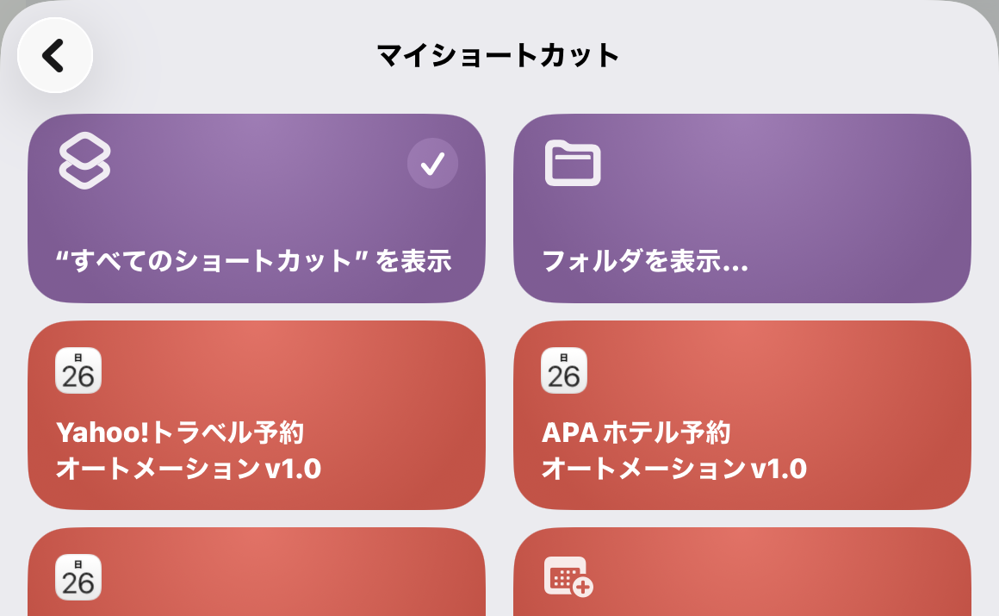
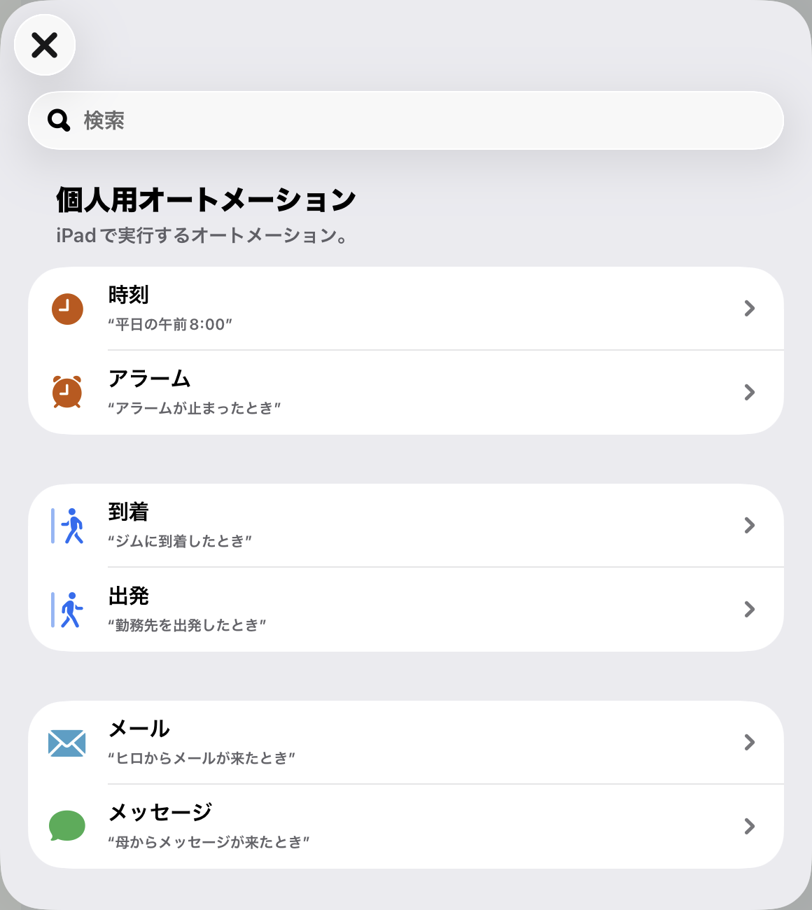
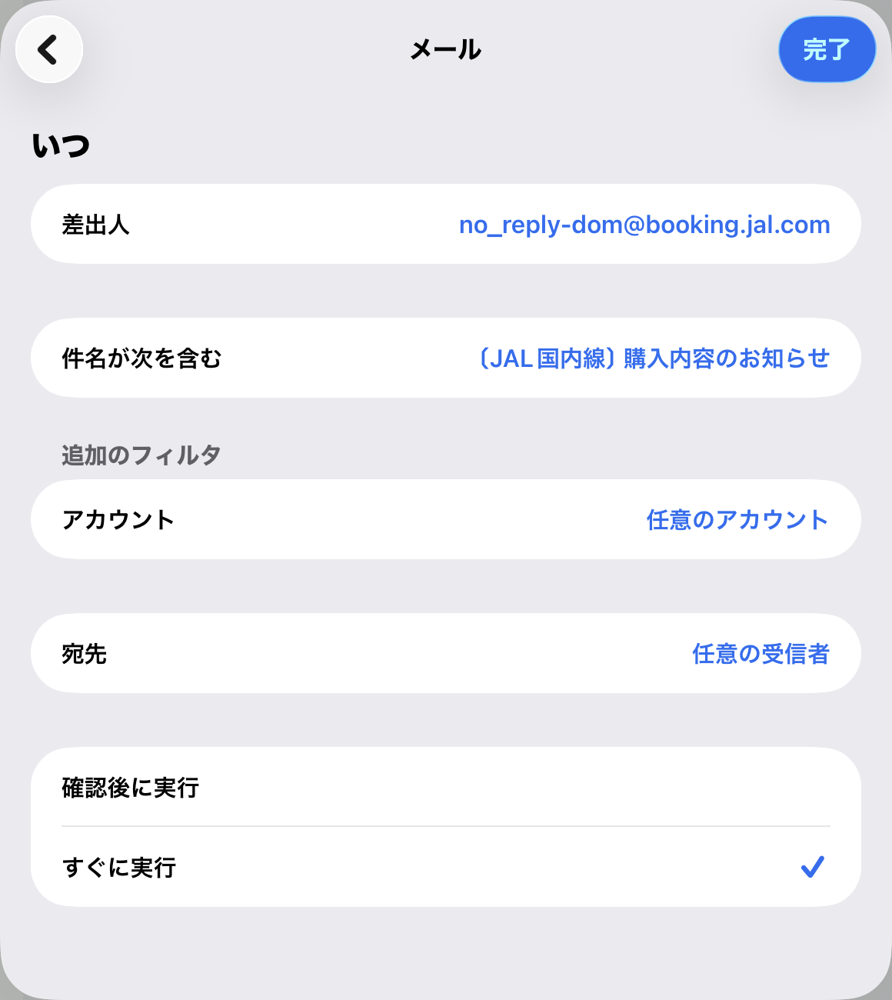
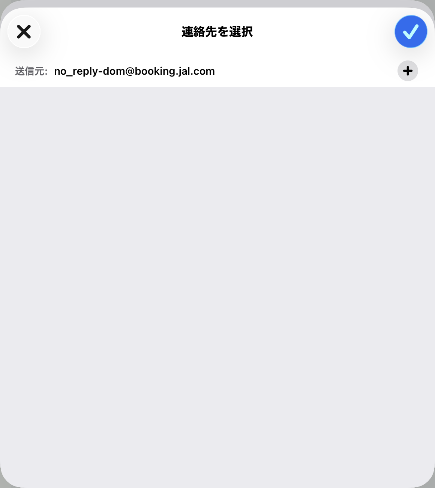
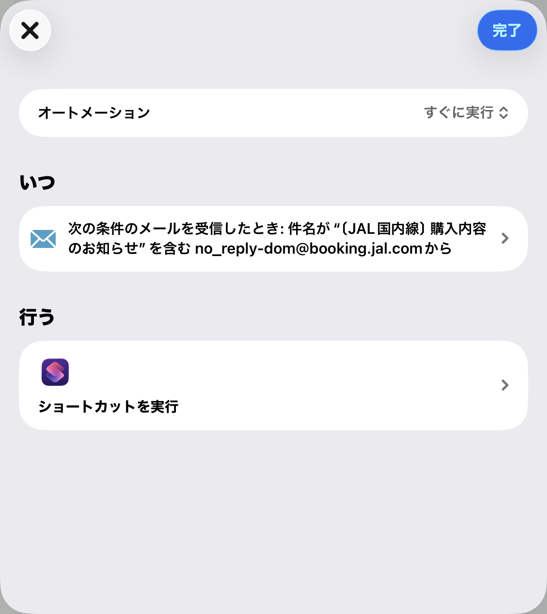
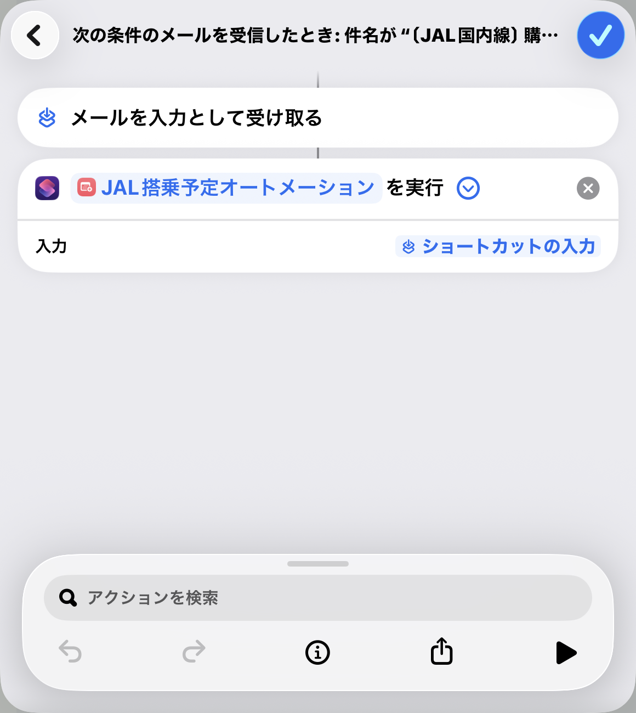
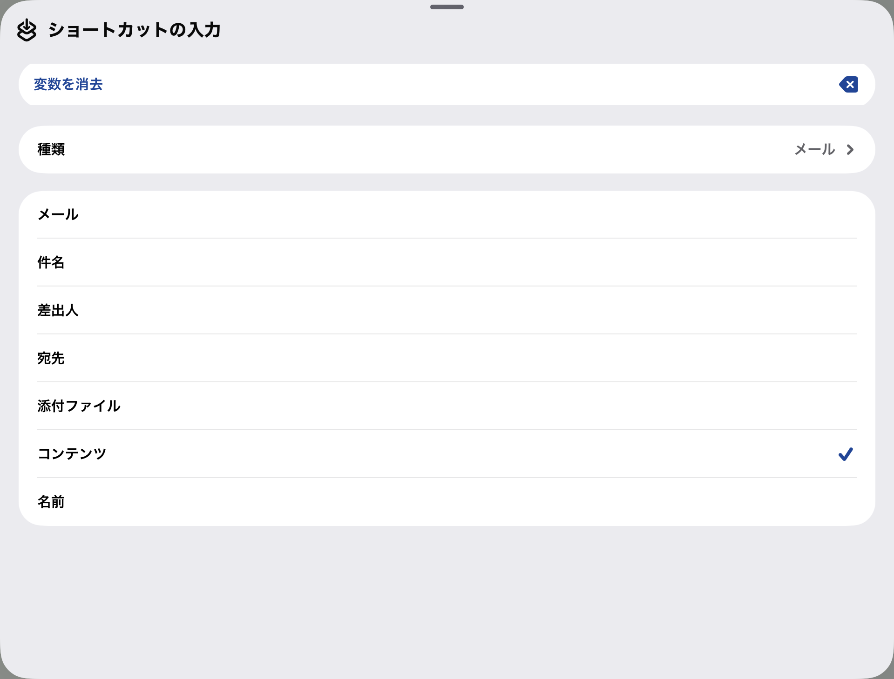
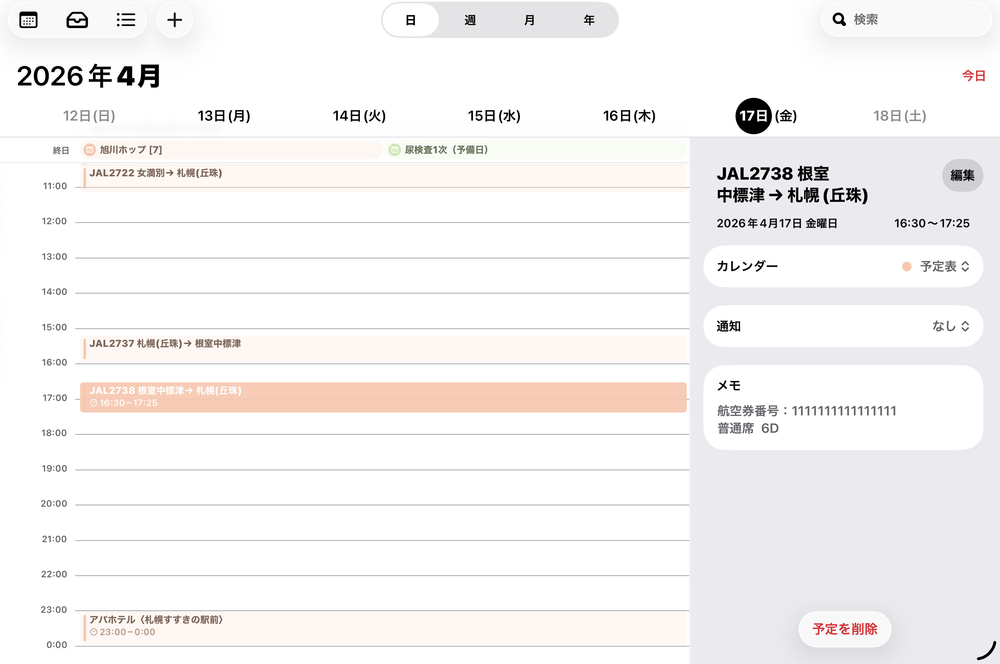

# JAL登場予定オートメーション

## 概要
「JAL登場予定オートメーション」は、JALからの予約・購入メールをトリガーとして、  
メール内容から自動的にカレンダーへ搭乗予定を登録する iOSショートカット構成です。

---

## 動作内容
- JALからのメール受信をトリガーに自動起動
- メール本文をショートカットに渡す
- フライト情報を解析
- カレンダーへ予定を自動登録

---

## 必要環境
- iOS（ショートカットAppが利用可能なバージョン）
- ショートカットApp
- メールApp（標準メール）

---

## セットアップ手順

---

### 1. ショートカットの準備

ショートカット一覧から以下を確認してください：

  

- ショートカット名：**JAL登場予定オートメーション**

---

### 2. オートメーションの作成

---

#### 2.1 トリガーの選択

「ショートカット」アプリ → 「オートメーション」 → 「新規作成」

  

- 「メール」を選択

---

#### 2.2 メール条件の設定

  

以下の条件を設定します：

- 差出人  
  `no_reply-dom@booking.jal.com`

- 件名に含む  
  `【JAL国内線】購入内容のお知らせ`

---

#### 2.3 詳細条件の設定

  

必要に応じて以下を設定可能：

- アカウント：任意
- 宛先：任意

---

#### 2.4 実行設定

  

- 「すぐに実行」を選択（重要）

---

### 3. アクションの設定

---

#### 3.1 メールを入力として受け取る

  

- 「メールを入力として受け取る」が設定されていることを確認

---

#### 3.2 ショートカットの実行

  

- アクション：「ショートカットを実行」
- ショートカット名：**JAL登場予定オートメーション**

---

#### 3.3 入力の設定

  

- 入力：ショートカットの入力（メールの内容）

---

## 動作確認

カレンダー登録例：

  

1. 条件に一致するメールを受信
2. 自動でショートカットが実行される
3. カレンダーに予定が追加される

---

## 注意点

- メールフォーマットが変更されると動作しない可能性があります
- 初回実行時にカレンダーアクセス許可が必要です
- 「実行の前に尋ねる」がONだと自動化されません

---

## カスタマイズ

- 件名条件を変更すれば他のメールにも対応可能
- ショートカットを編集すれば登録内容（タイトル・メモなど）を変更可能

---

## 補足

- メール本文はショートカットにそのまま渡されます
- 本ショートカットはメール解析ロジックに依存します
